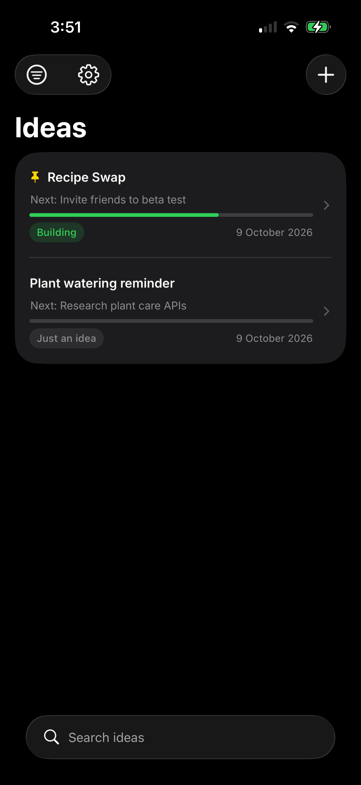

# 💡 Ideas

A simple iOS app for capturing app ideas and actually moving them forward.

Write an idea down, break it into steps, tick them off, and let AI suggest what to do next.

<p align="center">
  
</p>

## Features

**Capture and organise**
- Title, notes and a status for every idea: *Just an idea → Exploring → Building → Shipped* (or *Dropped*)
- Search across titles and notes
- Filter by status
- Pin important ideas to the top
- Swipe right to move an idea to its next stage

**Track progress**
- Break any idea into steps
- Progress bar and "Next: …" shown right in the list
- Edit, delete and reorder steps
- Status nudges: tick your first step and it offers *Building*, finish them all and it offers *Shipped*

**AI step suggestions**
- One tap to get 5 to 8 concrete next steps for an idea
- Edit and pick the ones you want before adding them
- "Suggest more" for a fresh batch without repeats
- Works with several providers, switchable in Settings:

| Provider | Cost |
| --- | --- |
| Groq | Free tier |
| Google Gemini | Free tier |
| OpenRouter | Free models |
| ChatGPT (OpenAI) | Paid API |
| Claude (Anthropic) | Paid API |

**Backup**
- Export all ideas and steps to a JSON file (Files or iCloud Drive)
- Import it back any time, duplicates are skipped automatically

## Privacy

- Everything is stored **on the device** with SwiftData. No account, no server.
- API keys are stored in the iPhone **Keychain** and are never part of this repo or backups.
- AI features only send the idea you're working on to the provider you chose. Free tiers may use that data to improve their models, so avoid sending anything confidential.

## Built with

- SwiftUI
- SwiftData
- Keychain Services
- iOS 17.6+

## Running it yourself

1. Clone the repo and open `Ideas.xcodeproj` in Xcode.
2. In **Signing & Capabilities**, choose your own team and change the bundle identifier.
3. Run on a simulator or your iPhone.
4. For AI suggestions, open **Settings** (gear icon) in the app, pick a provider, tap **Get key**, then **Paste key**.

## Project structure

```
Ideas/
├── IdeasApp.swift            App entry point
├── Idea.swift                Idea model and statuses
├── Step.swift                Step model
├── IdeaListView.swift        Main list, search, filters, swipe actions
├── IdeaEditView.swift        Idea details and step checklist
├── SuggestStepsView.swift    AI suggestions screen
├── SettingsView.swift        AI providers and backup
├── AIProvider.swift          Supported AI providers
├── AIService.swift           Talks to the selected AI
├── KeychainStore.swift       Secure key storage
├── Backup.swift              Export and import
└── KeyboardDoneButton.swift  ✓ button above the keyboard
```

## Roadmap

- Quick capture from Siri and the Action button
- More AI actions (improve notes, spot risks, one-line pitch)
- Attachments (screenshots, sketches, PDFs)
- Face ID lock
- iCloud sync
